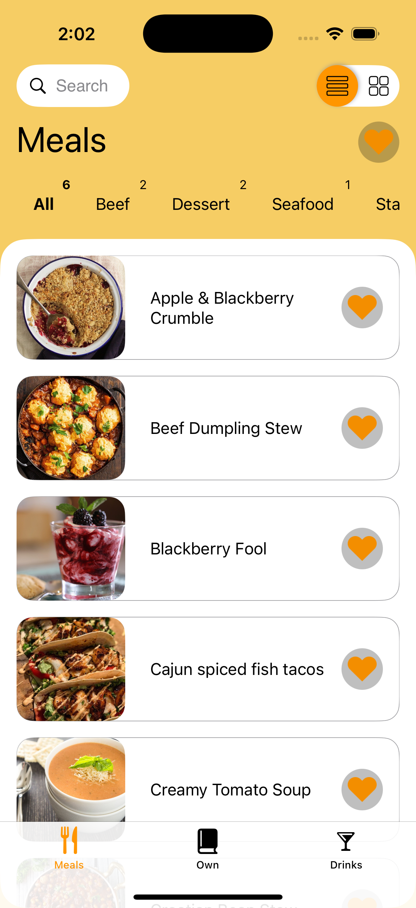

# Cookbook

## Стек
- Swift
- SwiftUI
- URLSession
- Realm
- RxSwift
- Swinject

## Описание

  

 
Приложение представляет собой книгу рецептов. Оно позволяет просматривать и редактировать как уже подготовленные рецепты, так и создавать собственные. Загруженные рецепты можно только просматривать, для их редактирования нужно сперва добавить их в собственные. 
 
Рецепты берутся из открытых API: 
- Длю блюд: https://www.themealdb.com 
- Для напитков: https://www.thecocktaildb.com 
 
Каждая вкладка приложения, то есть напитков, еды и собственных рецептов, имеет собственную базу данных. 
 
Можно просматривать объекты как в виде листа, так и в виде сетки. 

  

 

Есть возможность добавлять рецепты в избранное и выводить в отсортированном по избранному признаку виде. 

  

 

Каждый рецепт имеет собственную страницу, в которой можно посмотреть его название, изображение, ингредиенты и инструкцию по приготовлению. 

  

 

Реализован поиск объектов внутри вкладок. 
 

  

 

## Дополнительно
Приложение все еще находится в разработке. 
Идет работа над страницей Own, также нужно добавить переход из загруженного в собственные и написать тесты.
